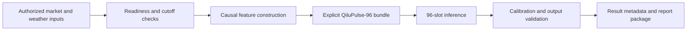

<div align="center">

# QiluPulse-96

**A Python workflow for 96-slot electricity-price forecasts for the Shandong market.**

[English](README.md) · [简体中文](README.zh-CN.md)

</div>

> [!WARNING]
> **Experimental status:** QiluPulse-96 is a research and engineering
> prototype. It is not production-ready and must not be used for trading,
> financial, operational, or regulatory decisions. Passing tests and the local
> results reported below do not establish live-market accuracy.

QiluPulse-96 provides the source code and command-line interfaces for a
target-day forecasting workflow. The workflow accepts authorized market and
weather inputs, applies a documented decision-time cutoff, loads an explicit
model bundle, and writes result metadata for inspection.

This repository is a source preview. It does not contain real market data,
production weather snapshots, private credentials, or production model
weights. Installation and synthetic tests demonstrate the software interface;
they do not establish forecast accuracy or production readiness.

For an actual run, keep the checkout (code root) separate from an ignored local
runtime root. The runtime root contains the operator's authorized inputs, model
bundle, caches, calibration ledger, and generated reports; none of those files
are part of the public source tree.

## At a glance

| Item | Current contract |
| --- | --- |
| Market scope | Shandong electricity market |
| Forecast output | 96 values at 15-minute resolution for one target date |
| Decision-time cutoff | `T-1 12:00 Asia/Shanghai` |
| Python distribution | `qilupulse96` |
| Python import path | `da_forecast` |
| Supported runtime | Python 3.11 or newer; [uv](https://docs.astral.sh/uv/) is used for the locked development environment |
| Release status | Experimental source preview; not qualified for production use |
| Included release material | Source interfaces, synthetic fixtures, tests, and documentation |
| Excluded release material | Real inputs, private runtime state, and production model weights |

## Current experimental evidence

The following figures summarize one local, frozen-bundle audit over
`2026-08-07` through `2026-08-20` (14 days and 1,344 fifteen-minute slots).
The audit used an `observed_proxy` weather panel, the causal `T-1 10:45
Asia/Shanghai` realtime cutoff, raw inference without recalibration, and
10,000 bootstrap resamples with seed `7`. These are exploratory local results,
not a public benchmark or a guarantee of future performance.

| Evaluation item | Result (CNY/MWh unless noted) |
| --- | ---: |
| Full frozen model MAE | 60.82 |
| Full frozen model RMSE | 80.94 |
| Full frozen model mean bias | +19.33 |
| Full frozen model within-day correlation | 0.804 |
| 28-day fixed-mean baseline MAE | 71.82 |
| Previous-day same-slot baseline MAE | 70.92 |
| 28-day same-slot-mean baseline MAE | 92.19 |

These are rounded aggregate summaries disclosed under the maintainer's release
authorization. They contain no row-level prices, raw workbooks, hashes, model
outputs, run identifiers, or report files. They are experimental evidence only;
they must be removed if the underlying data or derived-result permissions
change.

The ablation results indicate dependence on some input groups, but they do not
establish causality:

| Intervention | MAE | Change from full model |
| --- | ---: | ---: |
| Meteorology variables off | 114.09 | +53.27 |
| All weather variables off | 98.31 | +37.49 |
| Recent price-state variables off | 68.04 | +7.23 |
| Calendar date attributes off (slot encoding retained) | 60.91 | +0.09 |

Within this short window, the frozen model was not equivalent to a mean-only
predictor, and weather interventions changed its errors materially. The
calendar-date intervention did not show a stable predictive gain in this
sample. The findings describe input dependence of this particular frozen model;
they do not prove that weather or calendar variables have a causal effect on
market prices, and they should not be extrapolated across seasons or market
regimes.

The replay is marked `exploratory_backend_numeric_drift`: the historical
reference was produced on CUDA and the audit replay used CPU. The strict
parity threshold is `1e-4 CNY/MWh`, while the observed maximum backend
difference was approximately `7.55e-4 CNY/MWh`. The audit is therefore not a
parity-certified reproduction.

## Project scope

The repository covers the software around a forecast rather than a data
subscription or a downloadable trained model. The entire project remains
experimental; the term `production` in CLI and package names is retained only
for compatibility with the existing interface. The main components are:

- input adapters and readiness checks for authorized market and weather data;
- time and visibility contracts for target-date feature construction;
- the QiluPulse-96 model and its bundle format;
- inference, calibration, validation, and result-report interfaces; and
- command-line entry points, contract tests, and synthetic fixtures.

The public Python package keeps the import path `da_forecast` for compatibility
with the production scripts. The distribution name is `qilupulse96`.

## Current contracts

The current source and tests define interfaces for the following invariants:

- one target date produces 96 fifteen-minute rows;
- target-date labels and unavailable future data are rejected;
- interval outputs keep the order `P10 <= P50 <= P90` where intervals are used;
- model and bundle checksums are stored with result metadata;
- production results require the documented post-processing and ledger state; and
- explanation output is read-only with respect to prediction values.

These are software contracts and validation targets. Passing the repository's
tests does not demonstrate accuracy on a live market or on an independently
audited historical dataset.

## Intended use and non-goals

The repository is intended for:

- source and interface review;
- synthetic-data adapter development;
- reproducible tests for the public workflow; and
- integration with market, weather, and model inputs whose operator has the
  necessary use and redistribution rights.

It is not:

- a market-data subscription or guaranteed data download service;
- a ready-to-run forecast with a trained production checkpoint;
- a benchmark report or a claim of trading performance; or
- financial, trading, regulatory, or operational advice.

## Workflow



The workflow is intended to make the input cutoff, model identity, calibration
state, and result metadata inspectable. It does not remove the need for an
operator to validate source terms, data quality, and local market rules.

## Repository boundary

| Included | Not included by default |
| --- | --- |
| Model topology and public package interfaces | Real market or weather data |
| Production workflow, readiness checks, inference, calibration, and reporting | Production weather snapshots and private ledgers |
| Public market/weather adapters and provenance interfaces | Production checkpoints or model weights |
| Bundle manifest and checksum validation | API keys, cookies, certificates, or local configuration |
| Synthetic-data helpers and contract tests | Local runs, logs, reports, and generated output |
| CLI entry points and CI boundary checks | Material whose redistribution rights are not confirmed |

## Install and verify

The locked development path uses Python 3.11 or newer and `uv`:

```powershell
uv sync --locked --dev
uv run pytest -q
uv run python -m compileall -q src scripts
uv run python -c "import da_forecast; import da_forecast.production; print(da_forecast.__version__)"
```

Generate synthetic data for adapter development:

```powershell
uv run python scripts/generate_demo_data.py --days 90 --seed 7
```

The generated files are ignored by Git. They exercise software interfaces only;
they are not a market dataset, a production model, or evidence of live-market
performance.

## Prepare a private runtime

The preparation helper copies explicitly selected local inputs into an ignored
runtime directory. It does not modify the source archive or the original input
files:

```powershell
uv run python scripts/prepare_private_runtime.py `
  --public-root . `
  --runtime-root .private-runtime `
  --archive-root path/to/private/archive `
  --manual-workbook path/to/authorized/realtime-workbook.xlsx `
  --bundle-path artifacts/prediction-layer/bundles/authorized-bundle
```

The resulting layout is private runtime state, not a release layout:

```text
.private-runtime/
├── data/                 # authorized prices, calendar, weather, calibration
├── artifacts/            # selected bundle and checksums
├── runs/                 # prediction ledgers and report packages
└── runtime_manifest.json # local copy and hash record
```

The helper records hashes for copied files and directories. Review the
manifest and the bundle provenance before using the runtime for an operational
decision.

## Run with authorized inputs

The production runner accepts the code root, a separate runtime root, target
date, `as-of` timestamp, explicit bundle, and explicit realtime workbook. The
default `existing` weather mode is deliberately offline: it requires all 16
city snapshots issued at the exact `T-1 12:00 Asia/Shanghai` time and a complete
local history cache. It never substitutes a different issue time or silently
calls the current weather API.

```powershell
uv run python scripts/run_qilupulse96_production.py `
  --root . `
  --runtime-root .private-runtime `
  --target-date YYYY-MM-DD `
  --as-of YYYY-MM-DDT12:00:00+08:00 `
  --bundle-path .private-runtime/artifacts/prediction-layer/bundles/authorized-bundle `
  --manual-workbook .private-runtime/data/manual_realtime_prices.xlsx `
  --weather-source existing
```

Inspect a result package with the read-only inspector:

```powershell
uv run python scripts/inspect_qilupulse_result.py `
  --root .private-runtime `
  --target-date YYYY-MM-DD
```

If the exact target weather issue is unavailable, the runner returns a blocked
result such as `{"status":"blocked","reason":"target weather snapshot missing"}`
and does not create a forecast. Missing required data, calendar confirmation,
calibration, or model inputs are also blocking conditions. The public interface
does not use a contributor's machine-local default bundle path. Bundle
construction requires explicit training, calendar, market-data, and weather
provenance; the full command contract is in [`docs/RUNBOOK.md`](docs/RUNBOOK.md).

### Authorized historical weather acquisition

The strict runner does not silently fetch a replacement when the exact issue is
missing. An operator may perform a separate, authorized acquisition with
Open-Meteo's Single Runs API:

```powershell
uv run python scripts/fetch_qilupulse96_weather_snapshot.py `
  --runtime-root .private-runtime `
  --target-date YYYY-MM-DD `
  --as-of YYYY-MM-DDT12:00:00+08:00 `
  --model-run YYYY-MM-DDTHH:MM:00Z `
  --model ecmwf_ifs
```

`--as-of` is the QiluPulse business decision-time contract; `--model-run` is
the weather model's UTC initialization time. The script records both, checks a
complete 24-hour target day for all 16 stations, retains the raw responses, and
writes only to `.private-runtime`. Downloading a run later does not by itself
prove that it was available at the historical decision time.

When calibration replays dates earlier than the target date, the wider history
cache can be completed independently:

```powershell
uv run python scripts/complete_private_weather_history.py `
  --runtime-root .private-runtime `
  --start-date YYYY-MM-DD `
  --end-date YYYY-MM-DD
```

The end date is exclusive. This command uses the historical Archive API and
merges observed history without trimming a wider existing cache. It is not a
substitute for a target-day forecast issue.

## Data, model, and licensing boundary

Before using real inputs, the operator must record the source terms, issue time,
target-date availability, timezone, snapshot or version identity, and retention
or redistribution permission. Keep runtime data and those records outside the
source tree.

Production model weights are excluded by default. A separate model artifact
requires evidence for ownership, training-data provenance, feature provenance,
redistribution permission, manifest details, checksum, and intended use. See
[`docs/MODEL_RELEASE.md`](docs/MODEL_RELEASE.md).

Apache-2.0 applies only to code that the maintainers have cleared as original
or properly relicensed. It does not replace the license or notice requirements
of third-party or inherited material. Review
[`docs/PROVENANCE.md`](docs/PROVENANCE.md) and
[`THIRD_PARTY_NOTICES.md`](THIRD_PARTY_NOTICES.md) before redistributing a
derived release.

Do not commit real inputs, user-provided workbooks, private configuration,
credentials, calibration ledgers, checkpoints, or generated reports. The
`.gitignore` file does not replace review of the staged file list.

## Documentation

| Document | Description |
| --- | --- |
| [`docs/ARCHITECTURE.md`](docs/ARCHITECTURE.md) | Runtime flow, source layout, and contract invariants |
| [`docs/RUNBOOK.md`](docs/RUNBOOK.md) | Installation, synthetic data, bundle, and result-inspection commands |
| [`docs/FEATURE_ABLATION.md`](docs/FEATURE_ABLATION.md) | Offline weather, calendar, and price-state dependency audit |
| [`docs/MODEL_RELEASE.md`](docs/MODEL_RELEASE.md) | Evidence required before distributing model weights |
| [`docs/PROVENANCE.md`](docs/PROVENANCE.md) | Code, data, dependency, and redistribution provenance |
| [`CONTRIBUTING.md`](CONTRIBUTING.md) | Contribution and review expectations |
| [`SECURITY.md`](SECURITY.md) | Private-data and vulnerability reporting boundary |

## Limitations

This project is an experimental research and engineering implementation and is
not suitable for production deployment. The model has not been independently
validated over a sufficiently long period, across seasons, or across a broad
range of market conditions. Synthetic fixtures and the local audit above are
conditional on their inputs and do not establish future performance or live
market accuracy. Market rules, weather providers, data formats, and source
terms may change. A future operator would be responsible for checking data
quality, time contracts, provider terms, local market rules, and required
operational approvals.

The production CLI and `production` package name are interface-compatibility
labels, not evidence that production qualification has been completed. The
project does not provide financial, trading, regulatory, or operational advice,
and no forecast is a guarantee of a market outcome.

## License

Copyright 2026 XYuki.

Licensed under the Apache License, Version 2.0. See [`LICENSE`](LICENSE),
[`NOTICE`](NOTICE), and [`THIRD_PARTY_NOTICES.md`](THIRD_PARTY_NOTICES.md).
